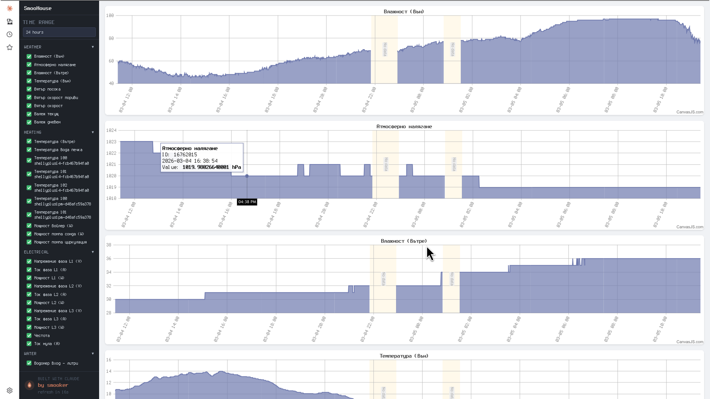

# Анализ на захванатите сигнали vs. изчисления на фърмуера

Дата: 2026-03-13, обновен: 2026-03-18

Инструментариум: FX2 Saleae Logic (sigrok/fx2lafw), канали D7=PULSE (PB10), D6=DIR (PB14).

## 1. Симетрични рампи (dvdtacc = dvdtdecc = 50 mm/s²)

### Параметри

| Параметър | Стойност | Описание |
|-----------|----------|----------|
| spmm | 400 стъпки/mm | 1600 стъпки/оборот ÷ 4 mm/оборот |
| mmpsmax | 10.0 mm/s | Максимална скорост |
| mmpsmin | 1.0 mm/s | Минимална скорост |
| dvdtacc | 50.0 mm/s² | Ускорение |
| dvdtdecc | 50.0 mm/s² | Забавяне |

Файл: `capture_combo.sr` (100 kHz)

### Брой импулси

| Движение | Очаквано | Измерено | Резултат |
|----------|----------|----------|----------|
| mover 1 (1 mm) | 400 | 400 | точно |
| movel 1 (1 mm) | 400 | 400 | точно |
| mover 5 (5 mm) | 2000 | 2000 | точно |
| movel 5 (5 mm) | 2000 | 2000 | точно |

### Максимална скорост

| Движение | Профил | Очаквано | Измерено | Разлика |
|----------|--------|----------|----------|---------|
| move 1 | триъгълен | 7.07 mm/s (354 µs) | 7.58 mm/s (330 µs) | 7.1% |
| move 5 | трапецовиден | 10.00 mm/s (250 µs) | 10.42 mm/s (240 µs) | 4.2% |

Разликите идват от квантоването при 100 kHz (±10 µs = ±4% при 250 µs период).

## 2. Асиметрични рампи (dvdtacc=50, dvdtdecc=100 mm/s²)

### Параметри

| Параметър | Стойност |
|-----------|----------|
| dvdtacc | 50.0 mm/s² |
| dvdtdecc | 100.0 mm/s² |
| accelSize | ~325 стъпки |
| decelSize | ~162 стъпки |

Файл: `capture_combo_final_speed.sr` (1 MHz)

### Измерени профили

| # | Движение | Импулси | Продължителност | Профил | Посока |
|---|----------|---------|-----------------|--------|--------|
| 1 | movel 1 | 400 | 199 ms | асим. трапец | CCW (L) |
| 2 | mover 1 | 400 | 199 ms | асим. трапец | CW (R) |
| 3 | movel 5 | 2000 | 594 ms | асим. трапец | CCW (L) |
| 4 | mover 5 | 2000 | 594 ms | асим. трапец | CW (R) |

### Детайли на рамп фазите

#### Къси движения (1 mm = 400 стъпки)

| Фаза | Стъпки | Продължителност | Период |
|------|--------|-----------------|--------|
| Ускорение | 221 | 123.8 ms | 2148→290 µs |
| Плато | 72 | 21.9 ms | ~290 µs |
| Забавяне | 106 | 53.7 ms | 290→2148 µs |

Пикова скорост: **8.62 mm/s** (не достига mmpsmax=10 — почти триъгълен профил)
Accel/Decel време: **2.30x** (очаквано ~2.0x)

#### Дълги движения (5 mm = 2000 стъпки)

| Фаза | Стъпки | Продължителност | Период |
|------|--------|-----------------|--------|
| Ускорение | 325 | 153.9 ms | 2148→240 µs |
| Плато | 1512 | 364.2 ms | 240 µs |
| Забавяне | 162 | 76.3 ms | 240→2148 µs |

Пикова скорост: **10.42 mm/s** (mmpsmax, +4.2% от квантоване)
Accel/Decel време: **2.02x** (очаквано 2.0x — перфектно!)

### Асиметрия — анализ

Забавянето е 2× по-стръмно от ускорението (dvdtdecc/dvdtacc = 100/50 = 2).
Измерено:

```
Трапец (5 mm):  accel = 153.9 ms, decel = 76.3 ms → ratio = 2.02x  ✓
Триъгълен (1 mm): accel = 123.8 ms, decel = 53.7 ms → ratio = 2.30x  (~2x + edge effects)
```

При кратките движения ratio-то е малко по-високо (2.3x вместо 2.0x) заради
ефектите от дискретизацията на рамп таблицата при ниските скорости.

### Визуален профил (ASCII)

```
Скорост (mm/s)
  10 |         ___________________________
     |        /                           \
   8 |       / accel=50 mm/s²    decel=100 \  mm/s²
     |      /                               \
   4 |     /                                 \
     |    /                                   \
   1 |___/                                     \___
     |
     └──────────────────────────────────────────── Време
      0    154 ms        518 ms         594 ms
           ←accel→       ←const→       ←decel→
           325 st.       1512 st.       162 st.
```

Забавянето заема **половината** от времето на ускорението, но използва
**половината** от стъпките — двойно по-стръмен наклон на скоростната крива.

## 3. Квантоване и грешки

### Честота на дискретизация

| Честота | Резолюция | Грешка при 250 µs | Грешка при 2500 µs |
|---------|-----------|--------------------|--------------------|
| 100 kHz | 10 µs | ±4.0% | ±0.4% |
| 1 MHz | 1 µs | ±0.4% | ±0.04% |

Захващанията при 1 MHz (capture_combo_final_speed.sr) дават значително
по-точни резултати.

### Систематични грешки

1. **Измереният min период е 240 µs вместо 250 µs** — фазово подравняване
   между TIM2 (96 MHz) и FX2 (48 MHz, от USB SOF). Разлика = 1 семпъл при
   100 kHz, 10 семпла при 1 MHz → вътрешна закръгляне на TIM2 ARR.

2. **Максимален период 2148 µs вместо 2500 µs** — първият и последният
   импулс от рампата може да не попаднат в захващането (setup delay).

## 4. Заключения

1. **Броят импулси е точен** — spmm=400, всяко движение дава точния брой стъпки
2. **Асиметричните рампи работят коректно** — dvdtdecc=2×dvdtacc дава 2× по-стръмно забавяне
3. **Accel/Decel ratio = 2.02x** за трапецовиден профил (перфектно съвпадение с теорията)
4. **Триъгълният профил** коректно не достига mmpsmax при къси движения
5. **Двете посоки са идентични** — DIR инверсия не влияе на timing-а

## Захванати файлове

| Файл | Честота | Съдържание | Параметри |
|------|---------|------------|-----------|
| `capture_all.sr` | 1 MHz | Pre-fix, `move 10`, decel bug | dvdtacc=dvdtdecc=50 |
| `capture_both.sr` | 100 kHz | Post-fix, `mover 5` + `movel 5` | dvdtacc=dvdtdecc=50 |
| `capture_both_speed.sr` | 100 kHz | Same + speed analog | dvdtacc=dvdtdecc=50 |
| `capture_combo.sr` | 100 kHz | 2 tri + 2 trap, symmetric | dvdtacc=dvdtdecc=50 |
| `capture_combo_final_speed.sr` | 1 MHz | 2 tri + 2 trap, asymmetric + speed | dvdtacc=50, dvdtdecc=100 |
| `capture_combo4_speed.sr` | 1 MHz | Same, longer capture window | dvdtacc=50, dvdtdecc=100 |
| `capture_jog_speed.sr` | 1 MHz | Jog button press/release | — |
| `capture_triangle_speed.sr` | 100 kHz | Triangle profile only + speed | dvdtacc=dvdtdecc=50 |

### Viewing

```bash
cd firmware
./go.sh view ../capture_combo_final_speed.sr   # asymmetric combo
./go.sh speed ../capture_both.sr               # symmetric + speed channel
```


