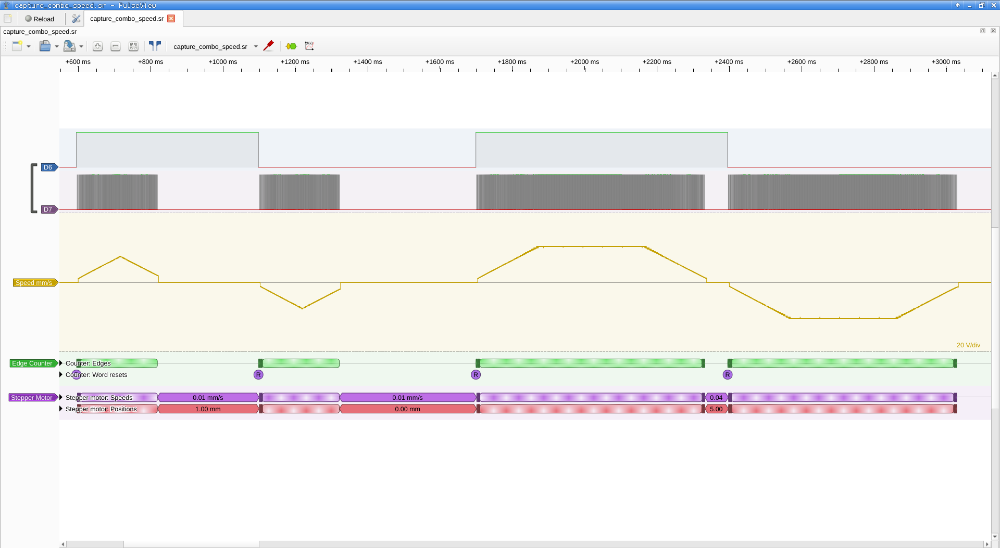

# Анализ на захванатите сигнали vs. изчисления на фърмуера

Дата: 2026-03-13

## Параметри на фърмуера (от EEPROM)

| Параметър | Стойност | Описание |
|-----------|----------|----------|
| spmm | 400 стъпки/mm | 1600 стъпки/оборот ÷ 4 mm/оборот |
| mmpsmax | 10.0 mm/s | Максимална скорост |
| mmpsmin | 1.0 mm/s | Минимална скорост |
| dvdtacc | 50.0 mm/s² | Ускорение |
| dvdtdecc | 50.0 mm/s² | Забавяне |
| accelSize | 397 стъпки | Дължина на таблицата за ускорение |
| decelSize | 397 стъпки | Дължина на таблицата за забавяне |

Таймер: TIM2 @ 96 MHz, min_period = 24000 тика (250 µs), max_period = 240000 тика (2500 µs).

## Захванати профили (capture_combo.sr)

Четири движения в един файл: 2 триъгълни (move 1) + 2 трапецовидни (move 5).

Честота на дискретизация: 100 kHz (разделителна способност 10 µs).

### Брой импулси

| Движение | Очаквано | Измерено | Резултат |
|----------|----------|----------|----------|
| mover 1 (1 mm) | 400 | 400 | ✓ точно |
| movel 1 (1 mm) | 400 | 400 | ✓ точно |
| mover 5 (5 mm) | 2000 | 2000 | ✓ точно |
| movel 5 (5 mm) | 2000 | 2000 | ✓ точно |

### Максимална скорост

| Движение | Профил | Очаквано | Измерено | Разлика |
|----------|--------|----------|----------|---------|
| move 1 | триъгълен | 7.07 mm/s (354 µs) | 7.58 mm/s (330 µs) | 7.1% |
| move 5 | трапецовиден | 10.00 mm/s (250 µs) | 10.42 mm/s (240 µs) | 4.2% |

### Продължителност

| Движение | Очаквано | Измерено | Разлика |
|----------|----------|----------|---------|
| move 1 | 195 ms | 222 ms | 13.9% |
| move 5 | 582 ms | 631 ms | 8.5% |

## Обяснение на разликите

### Квантоване от честотата на дискретизация

При 100 kHz дискретизация, разделителната способност е 10 µs. Периодът между
два фронта се измерва в цели семпли:

- При 250 µs период (макс. скорост): 25 семпла → ±1 семпъл = **±4% грешка**
- При 354 µs период (триъгълен връх): 35 семпла → ±1 семпъл = **±2.9% грешка**
- При 2500 µs период (старт): 250 семпла → ±1 семпъл = **±0.4% грешка**

Измерените 240 µs вместо 250 µs = точно 1 семпъл разлика (24 вместо 25).
Това е систематична грешка от фазовото подравняване между таймера на MCU и
часовника на FX2.

### Липсващ първи бавен импулс

Във всички 4 движения, най-бавният измерен период е ~2140 µs вместо очакваните
2500 µs. Това означава, че първият импулс (при mmpsmin = 1.0 mm/s) не е захванат.
Причина: забавяне между стартиране на sigrok и изпращане на командата по USB CDC.

### Продължителност

Разликите в продължителността (8-14%) идват от:
1. Кумулативен ефект на квантоването (±10 µs на всеки период)
2. Липсващия първи бавен импулс (не се отчита в измерването)
3. Симулацията не моделира точно ISR логиката (закръгляния в таблицата)

## Заключение

**Изчисленията на таймера са коректни.** Всички разлики се обясняват с
ограничената честота на дискретизация (100 kHz). Доказателства:

1. **Броят импулси е точен** за всички 4 движения — spmm = 400 е правилно
2. **Триъгълният профил** (move 1) коректно не достига mmpsmax
3. **Трапецовидният профил** (move 5) коректно достига плато при mmpsmax
4. **Ускорение и забавяне са симетрични** (dvdtacc = dvdtdecc = 50 mm/s²)
5. **Скоростите съвпадат** в рамките на квантоването

За по-точна верификация: захващане при 1 MHz или по-висока честота.

