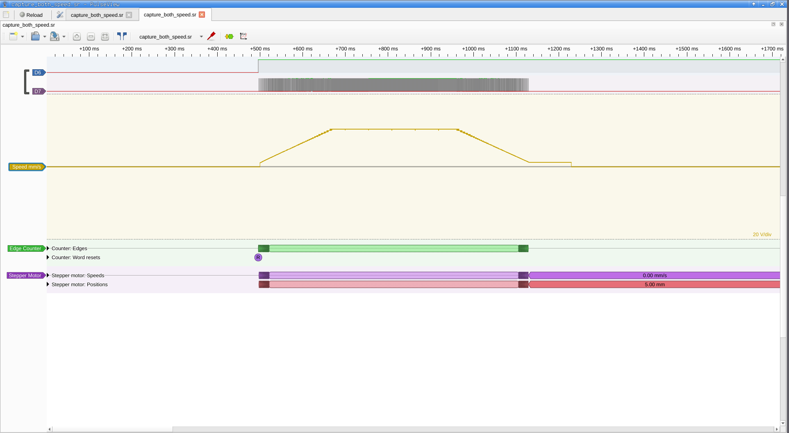

# stepper_sc Firmware

STM32F411CEU6 (Black Pill) stepper motor controller with USB CDC command interface,
trapezoidal velocity profiling, and EEPROM emulation in internal flash.

## Motor Control (stepper.c)

State machine: IDLE → ACCEL → CONST → DECEL → IDLE

- PWM: TIM2 Channel 3 @ 96 MHz, pulse width ~50 µs (5000 ticks)
- Ramp tables: precomputed via sqrt(v² + 2·a·s) using hardware VSQRT
- ISR: updates TIM2 ARR (period) each step for smooth velocity profile
- Direction: PB14 (DIR pin), set before first pulse

### Parameters (saved to EEPROM)

| Param    | Default | Unit    | Description              |
|----------|---------|---------|--------------------------|
| mmpsmax  | 50.0    | mm/s    | Maximum speed            |
| mmpsmin  | 1.0     | mm/s    | Minimum speed            |
| dvdtacc  | 100.0   | mm/s²   | Acceleration rate        |
| dvdtdecc | 80.0    | mm/s²   | Deceleration rate        |
| jogmm    | 1.0     | mm      | Jog distance             |
| stepmm   | 1.0     | mm      | Step button distance     |
| spmm     | 80      | steps/mm| Steps per millimeter     |

## USB CDC Commands

| Command              | Description                        |
|----------------------|------------------------------------|
| move \<mm\>          | Move by distance                   |
| movel \<mm\>         | Move left (negative)               |
| mover \<mm\>         | Move right (positive)              |
| steps \<n\>          | Move by step count                 |
| set \<param\> \<val\>| Set parameter                      |
| stop                 | Force deceleration stop            |
| params               | Print current parameters           |
| save                 | Persist params to EEPROM           |
| dump                 | Debug variable dump                |
| cls                  | Clear terminal screen              |
| uptime               | Print HAL_GetTick() ms             |
| reset                | Software reset (NVIC_SystemReset)  |
| help                 | Print command list                 |

Terminal escape sequences supported (arrow keys, F1-F4).

## Pin Assignments

| Pin  | Port | Function         | Type    |
|------|------|------------------|---------|
| PB10 | B    | PULSE (TIM2_CH3) | AF PWM  |
| PB14 | B    | DIR              | GPIO PP |
| PB15 | B    | BUZZ             | GPIO PP |
| PC13 | C    | LED_USER         | GPIO PP |
| PA3  | A    | ES_L (Limit L)   | EXTI    |
| PA4  | A    | ES_R (Limit R)   | EXTI    |
| PA6  | A    | BUTT_JOGL        | EXTI    |
| PA7  | A    | BUTT_JOGR        | EXTI    |
| PB0  | B    | BUTT_STEPL       | EXTI    |
| PB1  | B    | BUTT_STEPR       | EXTI    |
| PA11 | A    | USB_OTG_FS_DM    | USB     |
| PA12 | A    | USB_OTG_FS_DP    | USB     |
| PA13 | A    | SWDIO            | Debug   |
| PA14 | A    | SWCLK            | Debug   |

## EEPROM Emulation (eeprom_emul_uint32_t.c)

Dual-page wear-leveling using flash sectors 6 & 7 (128 KB each).

- 8-byte atomic records: 4-byte header (virtual address) + 4-byte data
- Page states: ERASED (0xFFFFFFFF) → RECEIVE (0xEEEEEEEE) → VALID (0xAAAAAAAA)
- Page-swap compaction when active page fills
- Power-loss safe: unfinished records ignored on recovery
- Virtual addresses 1-7 map to the 7 motor parameters

## Clock Configuration

- HSE: 24 MHz
- PLL: M=12, N=96 → 96 MHz SYSCLK
- APB1: 48 MHz (÷2)
- APB2: 96 MHz (÷1)
- TIM2: 96 MHz, initial period 9599, pulse 4800

## Build

```bash
cd firmware
make          # produces build/stepper_sc.elf/.hex/.bin
```

Post-CubeMX regeneration: run `./post_cubemx.sh` to restore -Wno-error=unused-parameter.

## Debug

```bash
./go_gdb.sh   # launches gdb-dashboard + script2.gdb
```

GDB commands:
- `ag` — attach to Black Magic Probe
- `ld` — load stepper_sc.elf/hex + verify

SVD register inspection via PyCortexMDebug + STM32F411.svd.

## FX2 Connection Test

Verify wiring between Black Pill and FX2 Saleae Logic using GDB to toggle
PULSE (PB10) and DIR (PB14), then reading the FX2 channels with sigrok.

**Channel mapping**: D7 = PULSE (PB10), D6 = DIR (PB14).

### GDB register reference

GPIOB base: `0x40020400`

| Offset | Register | Address      | Purpose          |
|--------|----------|--------------|------------------|
| 0x00   | MODER    | 0x40020400   | Pin mode (AF/GPIO/input) |
| 0x14   | ODR      | 0x40020414   | Output data (read) |
| 0x18   | BSRR     | 0x40020418   | Bit set/reset (write) |

PB10 bits: MODER[21:20], BSRR set=bit10, BSRR reset=bit26
PB14 bits: MODER[29:28], BSRR set=bit14, BSRR reset=bit30

Original MODER value: `0x50200280` (PB10=AF, PB14=output)

### Step-by-step connection test

```bash
# 1. Attach GDB and define peripheral memory region
arm-none-eabi-gdb -ex "file build/stepper_sc.elf" \
  -ex "target extended-remote /dev/ttyBmpGdb" \
  -ex "monitor swdp_scan" \
  -ex "attach 1" \
  -ex "mem 0x40000000 0x50000000 rw"

# 2. In GDB — switch PB10 from TIM2 AF to GPIO output
#    MODER[21:20] = 01 (general purpose output)
set *(uint32_t*)0x40020400 = (*(uint32_t*)0x40020400 & ~(3<<20)) | (1<<20)

# 3. Set PB10 HIGH (BSRR bit 10)
set *(uint32_t*)0x40020418 = (1<<10)

# 4. Read FX2 — expect D7=1
#    (run from another terminal)
#    sigrok-cli -d fx2lafw -c samplerate=100K --channels D6,D7 --samples 100 -O ascii
#    D7 should show '1' pattern, raw bytes = 0xBF

# 5. Set PB10 LOW (BSRR bit 26)
set *(uint32_t*)0x40020418 = (1<<26)

# 6. Read FX2 — expect D7=0
#    raw bytes = 0x3F

# 7. Test DIR: set PB14 HIGH (BSRR bit 14)
set *(uint32_t*)0x40020418 = (1<<14)

# 8. Read FX2 — expect D6=1
#    raw bytes = 0x7F (D6 high, D7 low)

# 9. Set PB14 LOW (BSRR bit 30)
set *(uint32_t*)0x40020418 = (1<<30)

# 10. Restore PB10 to TIM2 AF mode and resume
set *(uint32_t*)0x40020400 = 0x50200280
continue
detach
```

### Quick one-liner test (PB10 HIGH → capture → PB10 LOW)

```bash
# Set PB10 HIGH
arm-none-eabi-gdb -batch -ex "file build/stepper_sc.elf" \
  -ex "target extended-remote /dev/ttyBmpGdb" \
  -ex "monitor swdp_scan" -ex "attach 1" \
  -ex "mem 0x40000000 0x50000000 rw" \
  -ex "set *(uint32_t*)0x40020400 = (0x50200280 & ~(3<<20)) | (1<<20)" \
  -ex "set *(uint32_t*)0x40020418 = (1<<10)"

# Read FX2 — D7 should be high (0xBF)
sigrok-cli -d fx2lafw -c samplerate=100K --channels D6,D7 --samples 100 -O binary | xxd | head -1

# Set PB10 LOW
arm-none-eabi-gdb -batch -ex "file build/stepper_sc.elf" \
  -ex "target extended-remote /dev/ttyBmpGdb" \
  -ex "monitor swdp_scan" -ex "attach 1" \
  -ex "mem 0x40000000 0x50000000 rw" \
  -ex "set *(uint32_t*)0x40020418 = (1<<26)"
```

## Logic Analyzer Captures (2026-03-13)

FX2 Saleae Logic, channels D6 (DIR) + D7 (PULSE), 100 kHz sample rate.

**Channel mapping**: D7 = PULSE (PB10), D6 = DIR (PB14).

### Decel bug (FIXED)

Before fix: CONST->DECEL set `decelIndex = 0` (slow end of table).
Result: instant 10x speed drop at pulse 3604 (240->2400 us), no ramp.
Fix: `decelIndex = decelSize - 1` (fast end), smooth symmetric decel.

### Measured ramp profile (after fix, `move 5` = 2000 pulses)

| Phase | Pulses | Period range | Freq range | Steps |
|-------|--------|-------------|------------|-------|
| Accel | 0-370 | 2140->240 us | 467->4167 Hz | 371 |
| Const | 371-1629 | 240 us | 4167 Hz | 1259 |
| Decel | 1630-1999 | 240->1960 us | 4167->510 Hz | 370 |

Accel/decel are symmetric (371 vs 370 steps).

### Capture files

| File | Contents |
|------|----------|
| `capture_all.sr` | Pre-fix, 1 MHz, `move 10`, shows decel bug |
| `capture_both.sr` | Post-fix, 100 kHz, `mover 5` + `movel 5`, both directions |
| `capture_both_speed.sr` | Same + computed speed analog channel (mm/s) |
| `capture_both.pvs` | Pulseview session: edge counter + stepper_motor decoders |
| `capture_both_speed.pvs` | Same + analog speed trace, 64px traces |

### Viewing

```bash
cd firmware
./go.sh view                        # open capture_both_speed.sr in pulseview
./go.sh speed ../capture_both.sr    # generate speed channel + view
```



## Source Files

| File | Description |
|------|-------------|
| Core/Src/main.c | Main loop, USB CDC parsing, morse TX |
| Core/Src/stepper.c | Motor control engine, ramp tables |
| Core/Inc/stepper.h | Stepper API |
| Core/Inc/defines.h | GPIO/semaphore macros |
| Core/Inc/main.h | Parameter struct, CubeMX pin defs |
| Core/Src/eeprom_emul_uint32_t.c | Flash EEPROM emulation |
| Core/Inc/eeprom_emul_uint32_t.h | EEPROM API |
| USB_DEVICE/App/usbd_cdc_if.c | USB CDC callbacks |
